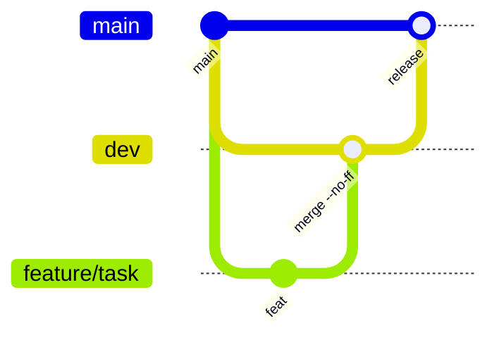

# Aurelia

Учебная витрина на React. Каталог, корзина, профиль, язык и валюта — в одном магазине.

Данные товаров приходят из [DummyJSON](https://dummyjson.com). Корзина и настройки живут в `localStorage`.

---

## Стек

| Слой | Инструменты |
| --- | --- |
| UI | React 19, Vite, Tailwind CSS |
| Состояние | Zustand |
| Данные | TanStack Query, Axios |
| Документация UI | Storybook 8 |
| Тесты | Jest, React Testing Library |
| Пакеты | **pnpm** |

Ветвление по GitFlow: `main` ← `dev` ← `feature/*`.

---

## Запуск

```bash
pnpm install
pnpm dev
```

Магазин откроется на `http://localhost:5173/`. Если порт занят, Vite возьмёт следующий.

| Команда | Что делает |
| --- | --- |
| `pnpm dev` | витрина |
| `pnpm test` | unit-тесты |
| `pnpm storybook` | UI-каталог на порту `6006` |
| `pnpm build` | продакшен-сборка |

`npm` и `yarn` не используем. В PowerShell, если `pnpm` ругается на `.ps1`, пишите `pnpm.cmd`.

---

## Возможности

- Каталог с бесконечным скроллом, поиском и фильтрами (категория, цена, рейтинг)
- Карточка товара, отзывы со звёздами на отдельной вкладке
- Корзина: выезжает сбоку, товар улетает в шапку при добавлении
- Профиль: язык, валюта, оформление заказа и история
- Локализация **RU / EN** и валюта **USD / ₽**
- Промокоды и симуляция заказа через `POST /carts/add`

---

## Промокоды

| Код | Скидка |
| --- | --- |
| `SALE10` | −10% |
| `SALE20` | −20% |
| `WELCOME` | −$15 |
| `FREESHIP` | бесплатная доставка |

Доставка $9.99. Бесплатно от $100 или по коду `FREESHIP`.

---

## GitFlow



1. Фича от `dev`: `git checkout -b feature/<task> dev`
2. Merge в `dev` с `--no-ff`, ветку задачи удалить
3. Релиз: merge `dev` → `main`
